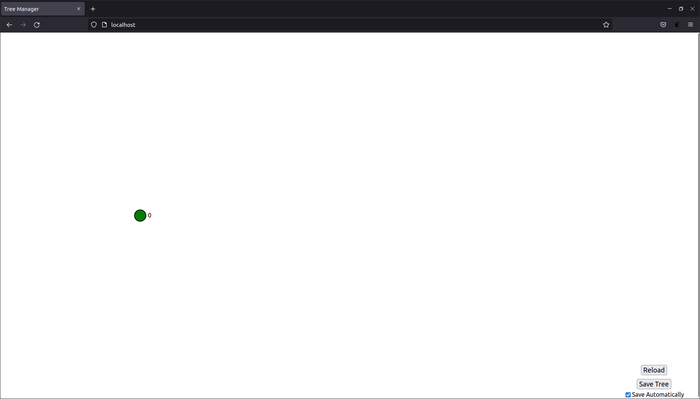
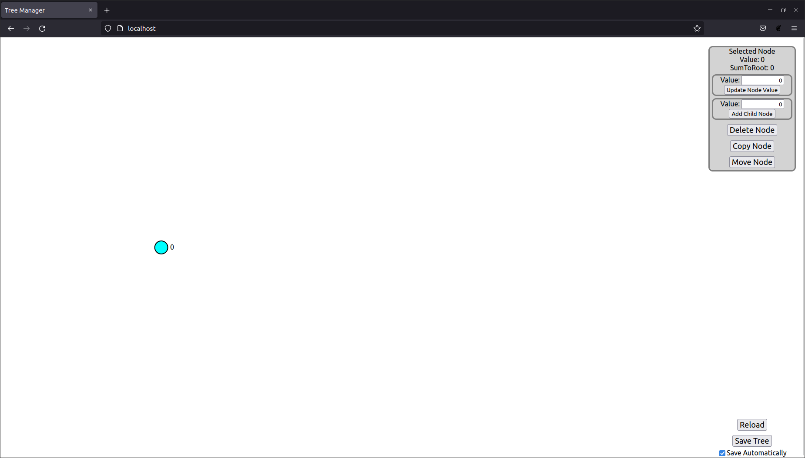
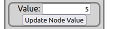
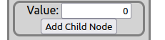
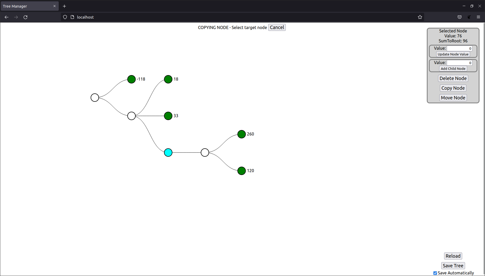
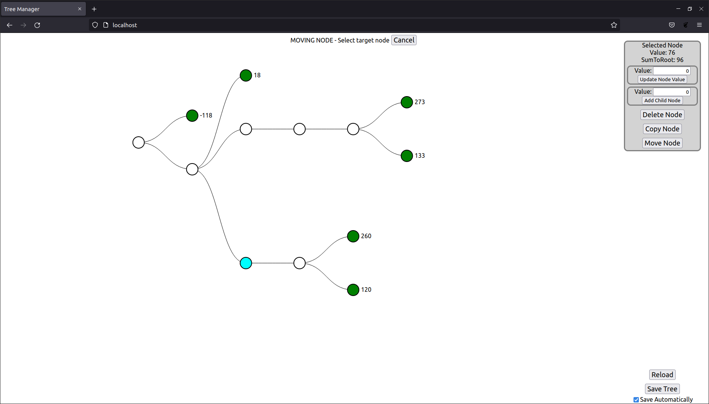
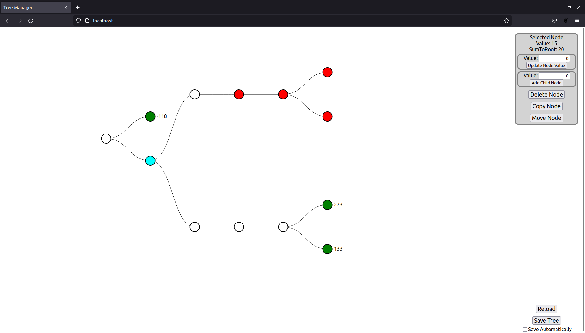

# TreeManager Application

## Usage

### Prerequisites for running application

- Network access
- Port 80 and 8080 available
- JDK 11
- docker and docker-compose

### Running the application

To run application execute command from root directory:

```bash
make build-and-run
```

or if docker images are built

```bash
make run
```

To stop application execute:
```bash
make run
```

### Using the API

API should be available at http://localhost:8080/

For details look into [TreeManager Backend Application README](TreeManager-BE/README.md) file

### Using the website

Website should be available at http://localhost

#### First look



On left we can see the root node (it's green because it has no children - making it a leaf). Next to the circle is the
value of sumToRoot.

In bottom right we can see:
- *Reload* button - for reloading the tree from API
- *Save* button - for saving the tree (when automatic saving is disabled)
- *Save automatically* checkbox - controls if tree modifications should be automatically saved.

#### Selecting a node



To select a node we simply need to click on it - it will get highlighted.

In top right we can see a new window showing selected node and possible actions, from top to bottom:
- Value of selected node
- Sum to root of selected node
- Area to update value of selected node
- Area to add child node with desired value to selected node
- *Delete Node* button - to delete selected node
- *Copy Node* button - to copy selected node with all its children to node clicked next
- *Move Node* button - to move selected node with all its children to node clicked next

#### Updating a node



To update a node:
1. Select the node
2. Put desired node value in editable box shown above
3. Click *Update Node Value* Button

#### Adding a child node



To update a node:
1. Select the node
2. Put desired child node value in editable box shown above
3. Click *Add Child Node* Button

#### Deleting a node

To delete a node:
1. Select the node
2. Click *Delete Node* button in selected node box

#### Copy a node

To copy a node:
1. Select the node
2. Click *Copy Node* button in selected node box
3. Click on a node to which the selected node will be copied to or
   cancel action by clicking *Cancel* button on top of the screen



#### Move a node

To move a node:
1. Select the node
2. Click *Move Node* button in selected node box
3. Click on a node to which the selected node will be moved to or
cancel action by clicking *Cancel* button on top of the screen



#### Save automatically disabled

When automatic saving is disabled, changed nodes are highlighted in red and have no sum to root.
In order to calculate sums tree needs to by saved by either: enabling automatic saving or clicking *Save Tree* button




## Next steps:
- Testing:
  - Extension of tests described in specific README files
  - E2E tests probably using cypress covering each use case listed above
  - Automatic execution of tests (setting up jenkins pipelines)
- Either:
   - Separation of backend application and database + extending the docker-compose
   - Serving the frontend from backend application for all-in-one solution
- Keeping track of changes
  - Backend endpoint for current change-id or amount of changes made on tree
  - Polling in frontend for change-id to keep the tree consistent
- Publishing docker images to allow running without building
- Specific steps for backend in frontend are listed in:
  - [TreeManager Backend Application README](TreeManager-BE/README.md)
  - [TreeManager Frontend Application README](TreeManager-FE/README.md)